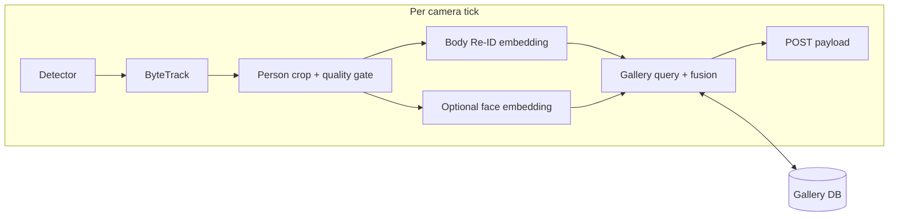

# Re-identification, Gallery Database, and Identity Fusion

This document describes how to extend the multi-camera tracking engine with **body re-identification (Re-ID)**, a **persistent embedding gallery**, and an optional **face recognition** layer that **fuses** with body-based tracking — without relying on face for frame-to-frame continuity.

It is aligned with the current pipeline in `tracking_engine/multi_camera.py`.

## Goals

- **Stable anonymous continuity** across cameras and time via body appearance (Re-ID), not only per-stream ByteTrack IDs.
- A **database-backed gallery** that accumulates high-quality embeddings over time under explicit quality and confidence rules.
- **Face recognition as a separate modality** that assigns or merges **named identities** when confidence is sufficient; body tracking remains the backbone for detection and short-term association.
- **Clear auditability**: fusion decisions, thresholds, and model versions are traceable.
- **GDPR-compliant** handling of biometric data (face embeddings are Art. 9 special-category data under EU law).

## Deployment context

In small-resident deployments (e.g. private home, 1–5 known persons), **faces are enrolled up-front** and act as the primary identity source. Body Re-ID is the **continuity glue** that propagates that identity across the floor plan when faces are not visible. In larger or public deployments, the system operates **anonymous-first** and only attaches a name when an enrolled face matches.

## Current pipeline (integration anchor)

1. Per camera: detector → ByteTrack (`tracking_engine/pipeline/tracker_bytetrack.py`) → homography to floor coordinates.
2. Each person in the outbound payload uses a **local** id: `t{tracker_id}` (string).
3. `PositionPoster` (`tracking_engine/pipeline/poster.py`) POSTs JSON batches to the configured sink.

Re-ID and global identity belong **after** tracked boxes exist and **before** assembling the `persons` list that is POSTed. ByteTrack IDs stay **local handles**; the system adds **global** IDs (and optional **identity** labels) derived from the gallery and fusion logic.



## Design principles

1. **Body-first continuity** — Frame-to-frame and coarse cross-camera association use body Re-ID. Face is not required every frame.
2. **Separate models, fused state** — Body embedding model and face embedding model are independent; fusion consumes both as evidence with different thresholds.
3. **Probabilistic fusion** — Update belief over an identity hypothesis (scores, tentative vs confirmed links) rather than performing irreversible merges on a single frame.
4. **Conservative gallery learning** — Add or update persistent gallery rows only when association confidence and crop quality exceed configured bars; cap prototypes per identity to limit drift.
5. **Versioned embeddings** — Never compare vectors across different `model_id` values.

## Storage stack

### Recommended default: PostgreSQL + pgvector

Use when the deployment is **centralized** (single service, enrollment UI, multiple consumers, backups, compliance):

- One ACID store for **metadata**, **vectors**, filtered similarity search, and audit tables.
- Natural fit for multi-tenant or multi-site rows (`tenant_id`, `site_id`) and retention policies.
- Use **HNSW indexes** (pgvector ≥ 0.5.0) — better recall/latency than `ivfflat` for our scale.

### Alternative: SQLite + FAISS

Use for **single-process**, **edge**, or **offline** bundles (e.g. the Pi 5 in-home deployment):

- SQLite holds relational entities, sighting logs, fusion events.
- FAISS handles approximate nearest-neighbor search; keep a stable **id map** between FAISS row index and DB primary keys.
- Snapshot FAISS to disk periodically; rebuild on startup if needed.

### Abstraction

Both backends implement the same logical interface (`GalleryStore` protocol): upsert identity, insert embedding with `model_id`, query top-k neighbors with optional filters, append fusion events. Only the backend changes.

## Logical data model

Stable IDs use **UUIDs** where persistence matters. ByteTrack IDs remain **ephemeral per stream**. A **global_track** is an anonymous persistent track; it may later be **linked** to an `identity` via fusion but is not the same entity.

### Entity summary

| Entity | Purpose |
|--------|---------|
| `model_registry` | Records every embedding model version, its dimension, metric (cosine/L2), and deprecation status. |
| `identity` | A person known to the system: anonymous-pending or enrolled, optional display name, consent record. |
| `global_track` | Persistent anonymous track aggregating sightings until (optionally) linked to an `identity`. |
| `appearance_embedding` | Body Re-ID vector tagged with `model_id`, linked to `global_track` and optionally `identity`. |
| `face_embedding` | Face template rows; same idea, stricter quality gates, encrypted at rest. |
| `sighting` | Camera + time range + best crops + tentative global assignment. |
| `fusion_event` | Append-only log of merges, splits, threshold hits, model versions. |
| `consent_record` | GDPR lawful-basis tracking per enrolled identity. |

### Schema sketch (PostgreSQL + pgvector ≥ 0.5)

```sql
CREATE EXTENSION IF NOT EXISTS vector;

CREATE TABLE model_registry (
  model_id         TEXT PRIMARY KEY,
  modality         TEXT NOT NULL CHECK (modality IN ('body','face')),
  dimension        INT NOT NULL,
  metric           TEXT NOT NULL DEFAULT 'cosine',
  deprecated       BOOLEAN NOT NULL DEFAULT false,
  created_at       TIMESTAMPTZ NOT NULL DEFAULT now()
);

CREATE TABLE identity (
  identity_id      UUID PRIMARY KEY DEFAULT gen_random_uuid(),
  tenant_id        TEXT NOT NULL,
  site_id          TEXT,
  display_name     TEXT,
  status           TEXT NOT NULL DEFAULT 'active',
  enrolled         BOOLEAN NOT NULL DEFAULT false,
  created_at       TIMESTAMPTZ NOT NULL DEFAULT now(),
  updated_at       TIMESTAMPTZ NOT NULL DEFAULT now()
);

CREATE TABLE global_track (
  global_track_id  UUID PRIMARY KEY DEFAULT gen_random_uuid(),
  identity_id      UUID REFERENCES identity(identity_id),
  status           TEXT NOT NULL DEFAULT 'tentative',  -- tentative | confirmed | merged | split
  first_seen       TIMESTAMPTZ NOT NULL DEFAULT now(),
  last_seen        TIMESTAMPTZ NOT NULL DEFAULT now()
);

CREATE TABLE appearance_embedding (
  id               BIGSERIAL PRIMARY KEY,
  global_track_id  UUID REFERENCES global_track(global_track_id),
  identity_id      UUID REFERENCES identity(identity_id),
  embedding        vector(512) NOT NULL,
  model_id         TEXT NOT NULL REFERENCES model_registry(model_id),
  quality          REAL,
  cam_id           TEXT,
  local_track_label TEXT,
  frame_ts         TIMESTAMPTZ,
  metadata         JSONB,
  created_at       TIMESTAMPTZ NOT NULL DEFAULT now()
);
CREATE INDEX appearance_hnsw ON appearance_embedding
  USING hnsw (embedding vector_cosine_ops) WITH (m = 16, ef_construction = 64);
CREATE INDEX appearance_model_idx ON appearance_embedding (model_id, identity_id);

CREATE TABLE face_embedding (
  id               BIGSERIAL PRIMARY KEY,
  identity_id      UUID REFERENCES identity(identity_id),
  embedding        vector(128) NOT NULL,  -- ArcFace MobileFaceNet = 128-D; adjust per model_registry
  model_id         TEXT NOT NULL REFERENCES model_registry(model_id),
  quality          REAL,
  enrolled         BOOLEAN NOT NULL DEFAULT false,
  cam_id           TEXT,
  frame_ts         TIMESTAMPTZ,
  metadata         JSONB,
  created_at       TIMESTAMPTZ NOT NULL DEFAULT now()
);
CREATE INDEX face_hnsw ON face_embedding
  USING hnsw (embedding vector_cosine_ops) WITH (m = 16, ef_construction = 64);

CREATE TABLE sighting (
  id               BIGSERIAL PRIMARY KEY,
  global_track_id  UUID NOT NULL REFERENCES global_track(global_track_id),
  cam_id           TEXT NOT NULL,
  started_ts       TIMESTAMPTZ NOT NULL,
  ended_ts         TIMESTAMPTZ,
  best_body_embedding_id BIGINT REFERENCES appearance_embedding(id),
  notes            JSONB
);

CREATE TABLE fusion_event (
  id               BIGSERIAL PRIMARY KEY,
  ts               TIMESTAMPTZ NOT NULL DEFAULT now(),
  event_type       TEXT NOT NULL,  -- link | unlink | merge | split | threshold_hit | conflict_deferred
  global_track_id  UUID,
  identity_id      UUID REFERENCES identity(identity_id),
  body_score       REAL,
  face_score       REAL,
  threshold_snapshot JSONB NOT NULL,
  model_ids        JSONB NOT NULL
);

CREATE TABLE consent_record (
  identity_id      UUID PRIMARY KEY REFERENCES identity(identity_id) ON DELETE CASCADE,
  lawful_basis     TEXT NOT NULL,  -- consent | legitimate_interest | contract
  granted_at       TIMESTAMPTZ NOT NULL,
  revoked_at       TIMESTAMPTZ,
  retention_days   INT
);
```

**Indexing notes:**
- HNSW preferred over IVFFlat for our scale (<1M vectors) and update frequency.
- Embedding dimension is fixed per column; if a future model differs, use a **separate table** or partition by `model_id`.
- Btree indexes on `(identity_id, created_at)` and partial indexes on `status = 'active'`.

## Cold-start behaviour

On day 1 the gallery is empty:

1. Every detected person creates a new `global_track` with `status = 'tentative'`.
2. After **N consecutive frames of stable body Re-ID self-match** (default N=15, ~1s at 15 fps), promote to `confirmed`.
3. Outbound payload exposes `global_id` immediately; consumers should expect **UUID churn for the first minutes** until enrolled identities (face) attach names.
4. If face enrollment is configured (small-deployment mode), system runs a **bootstrap phase**: when a face matches an enrolled identity, the current `global_track` is linked to that `identity_id` and the link persists across subsequent body Re-ID matches.

## Pipeline integration points

All steps refer to extending the loop in `multi_camera.py` (or a dedicated module invoked from it).

1. **Crop and quality gate** — Extract a tight person crop from each `tracked.xyxy`. Skip embedding if bbox area < 4000 px², blur (Laplacian variance) < 50, or aspect ratio outside [1.5, 4.0].
2. **Body embedding** — Run OSNet-x0.25 (or chosen model) ONNX, batched across persons per tick. L2-normalize. Tag with `model_id` from config.
3. **Short-term smoothing** — Maintain a running EMA prototype per active global track. Default **α = 0.3**; reset on track break > 2 s.
4. **Gallery query** — Top-k (default **k=5**) nearest neighbors with cosine distance; apply distance threshold (default **τ_body = 0.35**) and filters (`tenant_id`, `model_id`, active identities).
5. **Face path (optional)** — If head crop ≥ 80×80 px and frontal score from face detector ≥ 0.6, compute face embedding; otherwise omit. Never block body-only association.
6. **Fusion** — See state machine below.
7. **Learning (gallery write)** — Insert new `appearance_embedding` only when: quality > threshold AND match score in confident band AND identity has < `max_prototypes_per_identity` rows (default 30). Drop near-duplicates (cosine < 0.05 to any existing prototype).

## Fusion state machine

Each `global_track` carries a state:

| State | Meaning | Transitions |
|---|---|---|
| `tentative` | Newly created, < N frames stable | → `confirmed` after N matches; → garbage after timeout |
| `confirmed` | Stable body identity, no name | → `linked` on face match above τ_face_high (0.55 cosine) |
| `linked` | Bound to an `identity_id` | → `conflict_deferred` on contradictory evidence |
| `conflict_deferred` | Face says X, body cluster strongly says Y | Hold both hypotheses for grace window (5 s); resolve via majority or flag |
| `merged` | Two global_tracks were determined to be the same | Frozen; references redirect |
| `split` | One global_track was determined to be two people | Frozen; new tracks spawned |

**Hard rules:**
- A `linked` track cannot be silently re-linked to a different identity. Conflicts always log a `fusion_event` and enter `conflict_deferred`.
- Auto-merge two confirmed tracks **only if** one is unnamed and the other is linked, AND body match ≥ τ_body_high (0.20 cosine distance), AND time gap ≤ 30 s.
- Splits are conservative: require ≥ 3 contradictory face evidences before splitting a linked track.

## Internal API sketch (Python)

```python
class FusionEngine:
    def update(
        self,
        track_state: TrackState,
        body_embedding: np.ndarray,
        face_embedding: Optional[np.ndarray] = None,
    ) -> GlobalTrackState: ...

class GalleryStore(Protocol):
    def query_body(self, vec, k, filters) -> list[Match]: ...
    def query_face(self, vec, k, filters) -> list[Match]: ...
    def insert_appearance(self, ...) -> int: ...
    def insert_face(self, ...) -> int: ...
    def link_track_to_identity(self, global_track_id, identity_id, scores) -> None: ...
    def log_fusion_event(self, event) -> None: ...
```

`GlobalTrackState` carries: `global_track_id`, optional `identity_id` / `display_name`, state (tentative/confirmed/linked/...), confidence fields, last update metadata.

## HTTP and payload evolution

**Enrollment REST (future):**
- `POST /identities` — create identity with `display_name`, consent record
- `POST /identities/{id}/enroll-face` — multi-shot enrollment (recommend 3–5 frames, varied angles)
- `POST /identities/{id}/enroll-body` — optional pre-seed body prototypes
- `DELETE /identities/{id}` — GDPR erasure (cascades to all embeddings and sightings)

**Existing POST payload extension** (backward compatible — consumers ignore unknown keys):

```json
{
  "persons": [
    {
      "local_id": "t42",
      "global_id": "550e8400-e29b-41d4-a716-446655440000",
      "identity_id": "7c9e6679-7425-40de-944b-e07fc1f90ae7",
      "identity_name": "Jean Patrick",
      "track_state": "linked",
      "reid_score": 0.12,
      "face_score": 0.41
    }
  ]
}
```

## Configuration (YAML)

Add to `tracking_engine/config.multi_camera.yaml`:

```yaml
reid:
  backend: sqlite_faiss          # or postgres_pgvector
  dsn: "sqlite:///gallery.db"
  faiss_path: "./gallery.faiss"

  body:
    model_id: "osnet_x025_v1"
    dimension: 512
    threshold_match: 0.35
    threshold_high: 0.20
    ema_alpha: 0.3
    top_k: 5
    min_bbox_area: 4000
    min_blur_var: 50

  face:
    enabled: true
    model_id: "arcface_mfn_v1"
    dimension: 128
    threshold_high: 0.55
    min_face_size: 80
    min_frontal_score: 0.6

  gallery:
    max_prototypes_per_identity: 30
    min_quality_to_store: 0.7
    dedup_distance: 0.05
    max_writes_per_minute: 60

  fusion:
    tentative_to_confirmed_frames: 15
    conflict_grace_seconds: 5
    auto_merge_max_gap_seconds: 30
```

## Phased rollout

1. **Phase A** — Body Re-ID + anonymous `global_track_id` across cameras; gallery read/write with quality gates; POST includes `global_id`. Cold-start and tentative→confirmed transitions live.
2. **Phase B** — Gallery management UI, retention policies, observability metrics, manual merge/split tools.
3. **Phase C** — Face enrollment, face gallery, probabilistic fusion, `fusion_event` audit stream, named fields in POST.

## Observability & metrics

Expose Prometheus metrics:

| Metric | Type | Purpose |
|---|---|---|
| `reid_body_match_score` | Histogram | Tune τ_body threshold |
| `reid_face_match_score` | Histogram | Tune τ_face threshold |
| `reid_false_merge_total` | Counter | Manual flag of bad merges |
| `reid_false_split_total` | Counter | Manual flag of bad splits |
| `reid_gallery_size{identity_id}` | Gauge | Detect drift (too many prototypes) |
| `reid_inference_latency_ms{stage}` | Histogram | Per-stage (crop, body, face, query) |
| `reid_track_state{state}` | Gauge | Live count of tracks per state |

Alarm thresholds:
- False merge rate > 1% over 24h → page
- p99 inference latency > 150ms → warn
- Gallery growth > 100 prototypes/identity → warn (drift suspected)

## Expected latencies (Raspberry Pi 5, CPU-only)

| Stage | Per person | Notes |
|---|---|---|
| Crop + quality | 1–2 ms | OpenCV |
| Body embedding (OSNet-x0.25 ONNX) | 8–12 ms | Quantised INT8 |
| Face detect (SCRFD-500MF) | 6–10 ms | Only when face path triggered |
| Face embedding (ArcFace MFN) | 10–15 ms | Only on confirmed face crop |
| Gallery query (FAISS, k=5) | < 1 ms | Up to ~10k vectors |
| **Total per person (body only)** | **~15 ms** | Budget: 5 people in < 100 ms |
| **Total per person (body + face)** | **~40 ms** | Face path triggers occasionally |

Comfortably fits the 150 ms zone-crossing budget.

## Non-functional requirements

- **Latency** — Batch body (and face) inference; async write-behind for non-critical gallery inserts.
- **Multi-tenancy** — Scope all queries by `tenant_id` / `site_id` from config.
- **Privacy and compliance (GDPR)**:
  - Face embeddings are **Art. 9 special-category biometric data**; lawful basis = **explicit consent** (recorded in `consent_record`).
  - **DPIA** required before production deployment with face enabled.
  - Face embeddings encrypted at rest (column-level or filesystem).
  - Source images of faces are **never persisted** — only embeddings.
  - Hard delete on user request (CASCADE on `identity` removes embeddings, sightings, consent record).
  - Retention: default 90 days for sightings, indefinite for enrolled embeddings (until revoked).
- **Model upgrades** — Never mix vectors from different `model_id` in the same index query; migrate or partition tables by `model_id`. See migration playbook below.
- **Operations** — Backup/restore includes vector tables and indexes; document pgvector maintenance (reindex after bulk load).

## Model migration playbook

When upgrading the body Re-ID model (e.g. `osnet_x025_v1` → `osnet_x025_v2`):

1. Register new `model_id` in `model_registry`.
2. **Dual-write window** (≥ 7 days): pipeline produces embeddings under *both* model IDs.
3. Queries continue using old `model_id` until coverage of new model reaches ~90% of active identities.
4. Cutover: queries switch to new `model_id`.
5. Mark old `model_id` deprecated; keep rows for audit; drop after retention period.

Same procedure for face models, with explicit user re-consent if model class changes materially.

## Risks and mitigations

| Risk | Mitigation |
|------|------------|
| Gallery drift from bad updates | Conservative thresholds, prototype caps, freeze policy, manual review queue. |
| Cross-person confusion with similar clothing | Multi-frame voting, spatial/temporal gating, face evidence when available. |
| Irreversible wrong merge | Probabilistic fusion, deferred conflicts, audit log, no hard merge on single modality. |
| Face at distance | Use face only when quality passes; never depend on face for continuity. |
| Model change breaks search | `model_id` versioning, dual-write migration. |
| GDPR breach via face data | Encryption at rest, consent records, DPIA, hard-delete cascade. |
| Pi 5 latency spikes under 5-person load | Batched inference, async DB writes, INT8 quantised models. |

## References in this repository

- `tracking_engine/multi_camera.py` — main loop and payload assembly.
- `tracking_engine/pipeline/tracker_bytetrack.py` — local ByteTrack IDs.
- `tracking_engine/pipeline/poster.py` — JSON POST transport.
- `tracking_engine/config.multi_camera.yaml` — configuration entry point for Re-ID settings.