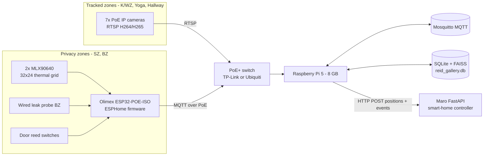
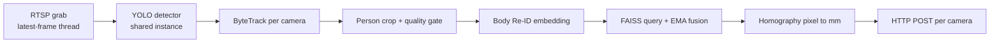
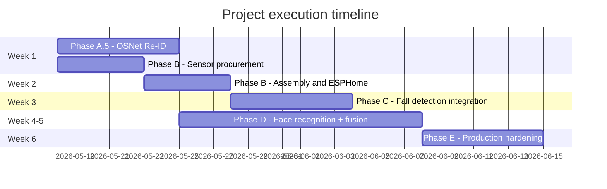

# Indoor Tracking System — Master Implementation Plan

Single source of truth for the remaining ~50% of the project. This document supersedes ad-hoc notes; per-phase work items, exit criteria, and file-level references are below.

- **Audience:** project owner, future maintainers, contractors picking up any single phase.
- **Status snapshot:** hardware plan, calibration, multi-camera tracking, and Phase A Re-ID scaffold are in place. Re-ID embedder is a placeholder; privacy-zone sensors, fall detection, face recognition, and production hardening are pending.
- **Companion docs:** [tracking_engine/plan/re_identification_and_identity_fusion.md](tracking_engine/plan/re_identification_and_identity_fusion.md) (Re-ID architecture deep-dive), [camera_placement_plan/README.md](camera_placement_plan/README.md) (camera/sensor geometry), [tracking_engine/README_MULTI_CAMERA.md](tracking_engine/README_MULTI_CAMERA.md) (current runtime contract).

---

## 1. Project Context

### 1.1 Goal

Build a local, offline, privacy-respecting indoor positioning service that knows where every person is inside a private home in real time. The smart home (Maro FastAPI) consumes positions and makes **rooms react to people** instead of people commanding rooms (music follows, lights pre-warm, sockets cut behind a leaving occupant). Bedroom and bathroom are tracked without optical cameras — thermal IR only — and contribute fall events.

### 1.2 Non-goals

- Not cloud-based — fully offline, LAN only.
- Not a smart-home controller — this service publishes positions and events; Maro acts on them.
- Not surveillance — no video recording, no face images persisted (only embeddings).
- Not GPU-dependent — Raspberry Pi 5 CPU only.

### 1.3 Hard constraints

- **Compute:** Raspberry Pi 5 (8 GB), CPU only.
- **Network:** wired LAN; PoE for cameras and ESP32 sensor nodes. No Zigbee/Wi-Fi for safety-critical sensors.
- **Concurrent people:** up to 5.
- **Latency budget:** < 150 ms from zone crossing to POST.
- **Privacy zones:** SZ (bedroom), BZ (bathroom) — thermal sensor only, no images.
- **Units / origin:** millimetres, origin = NW corner of the floor-plan envelope (top-left), `+x` east, `+y` south. Envelope ≈ 19 800 × 10 200 mm.
- **Output:** HTTP POST JSON to Maro at `poster.url` (see [tracking_engine/config.multi_camera.yaml](tracking_engine/config.multi_camera.yaml)).
- **Compliance:** GDPR — face embeddings are Article 9 special-category biometric data; explicit consent, encryption at rest, hard delete cascade, DPIA required.

### 1.4 Floor-plan zones

- **K/WZ** (kitchen + living room) — full camera tracking. L-shape clipped at `FIREPLACE_X_MM = 10000`.
- **Yoga** — full camera tracking, rectangle 14 100–17 900 × 5 300–8 800 mm.
- **Hallway** — narrow tracked strip linking Yoga to the rest of the floor (cam 7).
- **SZ** (bedroom) — thermal IR only, polygon defined in `cameras_config.json::privacy_thermal_zones_mm.SZ`.
- **BZ** (bathroom) — thermal IR + wired leak probe.
- **Terrace** — ignored.

---

## 2. System Architecture

### 2.1 End-to-end data flow



### 2.2 Per-camera tick (current behaviour)



Loop lives in [tracking_engine/multi_camera.py](tracking_engine/multi_camera.py) (`run()`). Re-ID hook is `reid.observe(...)` at line 263; payload assembly merges Re-ID extras (`global_id`, `track_state`, `reid_score`).

### 2.3 Coordinate convention

| Axis | Direction | Notes |
|------|-----------|-------|
| `x_mm` | east (right on plan) | 0 at NW corner |
| `y_mm` | south (down on plan) | 0 at NW corner |
| `z_mm` | up (toward ceiling) | ceiling = 3000 mm |

All payload coordinates, polygons, and mount positions use millimetres in this frame.

---

## 3. Current State Assessment

### 3.1 Done

- **Camera placement** — 7 cameras, mounts in [camera_placement_plan/generate_camera_plan.py](camera_placement_plan/generate_camera_plan.py); exported to [camera_placement_plan/output/cameras_config.json](camera_placement_plan/output/cameras_config.json).
- **Homography calibration** — [tracking_engine/pipeline/homography.py](tracking_engine/pipeline/homography.py) with stored matrices in [tracking_engine/calibration/camera_calibrations.json](tracking_engine/calibration/camera_calibrations.json).
- **Multi-camera engine** — [tracking_engine/multi_camera.py](tracking_engine/multi_camera.py); per-camera ByteTrack ([tracking_engine/pipeline/tracker_bytetrack.py](tracking_engine/pipeline/tracker_bytetrack.py)); HTTP poster ([tracking_engine/pipeline/poster.py](tracking_engine/pipeline/poster.py)); RTSP latest-frame ingest ([tracking_engine/pipeline/ingest.py](tracking_engine/pipeline/ingest.py)).
- **Re-ID Phase A scaffold** — coordinator with EMA + tentative→confirmed promotion ([tracking_engine/reid/coordinator.py](tracking_engine/reid/coordinator.py)); SQLite + FAISS gallery with model_registry, identity, global_track, appearance_embedding, fusion_event tables ([tracking_engine/reid/gallery_sqlite.py](tracking_engine/reid/gallery_sqlite.py)); quality gating ([tracking_engine/reid/crop_quality.py](tracking_engine/reid/crop_quality.py)).
- **Thermal fall-detection algorithm (no hardware yet)** — stateful detector with SZ/BZ rules and water-leak gating in [camera_placement_plan/thermal_fall_detection.py](camera_placement_plan/thermal_fall_detection.py).

### 3.2 Known gaps (what this plan resolves)

- Body embedder is a deterministic grayscale fallback ([tracking_engine/reid/embed.py](tracking_engine/reid/embed.py), `FallbackBodyEmbedder`, line 28). It cannot reliably tell two people apart and silently degrades Re-ID accuracy.
- No privacy-zone sensors deployed. The thermal fall logic is unit-tested only.
- No face recognition, no enrollment flow, no name resolution in payloads.
- No metrics, no logging discipline, no service supervisor, no backups.
- No GDPR documentation, no DPIA.

### 3.3 Open decisions resolved in this plan

- **Thermal sensor:** MLX90640 (32 × 24). The 8×8 AMG8833 references in [camera_placement_plan/README.md](camera_placement_plan/README.md) and `cameras_config.json` are treated as legacy and migrated in Phase B.
- **Body Re-ID model:** OSNet-x0.25, ONNX exported from `torchreid`, 512-D, INT8 quantised.
- **Face stack:** SCRFD-500MF detector + ArcFace MobileFaceNet embedder (128-D), both ONNX.
- **Gallery backend:** SQLite + FAISS on the Pi (single-home edge deployment). PostgreSQL + pgvector deferred to Phase F.

---

## 4. Roadmap Overview

| Phase | Theme | Duration | Status |
|-------|-------|----------|--------|
| A.5 | Real body Re-ID (OSNet ONNX) | Week 1 | Pending |
| B | Privacy-zone sensors (MLX90640 + ESP32) | Week 2 (in parallel with A.5) | Pending |
| C | Thermal fall detection + live dots wired to MQTT and POST | Week 3 | Code complete; enable on site — [`docs/privacy_zone_production_runbook.md`](../docs/privacy_zone_production_runbook.md) |
| D | Face recognition, fusion, enrollment | Week 4–5 | Pending |
| E | Production hardening | Week 6 | Pending |
| F | Optional future work | Backlog | Pending |

Recommended execution: **A.5 and B run in parallel** (hardware ships while OSNet integration progresses). C waits for hardware. D depends on a stable A.5. E follows D.



---

## 5. Phase A.5 — Real Body Re-ID (OSNet ONNX)

**Why first:** the current placeholder embedder makes global IDs functionally meaningless for two similar-looking people. Without this, Phase D fusion is also unreliable.

### 5.1 Prerequisites

- Python venv on a development machine with `torch`, `torchreid`, `onnx`, `onnxsim` installable.
- A representative footage clip with at least two distinct people walking across the floor (used for tuning).

### 5.2 Steps

1. **Export OSNet-x0.25 → ONNX**
   - Create `tools/export_osnet_onnx.py` that loads `torchreid` pretrained OSNet-x0.25 (input 256 × 128 RGB) and exports to `tracking_engine/models/osnet_x025.onnx`. Output dim must be 512. Run `onnxsim` for graph simplification.
   - Optional: INT8 quantise via `onnxruntime.quantization.quantize_dynamic` to `osnet_x025_int8.onnx` for Pi 5.
   - Verify with a tiny self-test: two crops of the same person → cosine distance < 0.2; two different people → distance > 0.4.

2. **Wire into config**
   - In [tracking_engine/config.multi_camera.yaml](tracking_engine/config.multi_camera.yaml) set `reid.enabled: true` and `reid.body.onnx_model_path: models/osnet_x025_int8.onnx`.
   - Confirm `reid.body.dimension: 512` and `reid.body.model_id: osnet_x025_v1` match the export.

3. **Loud fallback warning** — In [tracking_engine/reid/embed.py](tracking_engine/reid/embed.py) `create_body_embedder()` (around line 120), emit a `print(... file=sys.stderr)` warning when `OnnxBodyEmbedder` cannot load and the system falls back to `FallbackBodyEmbedder`. Also reflect the warning in `ReIDCoordinator.embedder_backend()` so the startup line in [tracking_engine/multi_camera.py](tracking_engine/multi_camera.py) (line 170–173) makes the failure obvious.

4. **Threshold tuning on real footage**
   - Capture 5 minutes per camera with two known people. Run the engine. Dump every `reid_score` from the POST payload.
   - Histogram intra-person (same `local_id` over time) vs inter-person scores. Set `reid.body.threshold_match` at the inter/intra boundary, `threshold_high` ≈ 0.6 × `threshold_match`.
   - Re-tune `min_bbox_area`, `min_blur_var`, `tentative_to_confirmed_frames` if false negatives dominate.

5. **Schema audit** — Run `sqlite3 reid_gallery.db ".schema"` and confirm tables match the spec in [tracking_engine/plan/re_identification_and_identity_fusion.md](tracking_engine/plan/re_identification_and_identity_fusion.md) section "Schema sketch". Add a Python smoke test under `tracking_engine/reid/tests/test_gallery_schema.py` that asserts the presence of `model_registry`, `identity`, `global_track`, `appearance_embedding`, `fusion_event`.

6. **End-to-end demo on laptop**
   - Two MP4 clips of two known people walking; run via `--video` overrides as in [tracking_engine/README_MULTI_CAMERA.md](tracking_engine/README_MULTI_CAMERA.md).
   - Verify the POST payload (against [tracking_engine/mock_maro_server.py](tracking_engine/mock_maro_server.py)) shows two stable `global_id` UUIDs that persist across camera handovers.

### 5.3 Exit criteria

- Two distinct people in test footage each keep a single `global_id` across at least one camera-to-camera handover.
- p50 `reid_score` for the matched person < 0.25; p95 < 0.4. False merges per 10 min: 0.
- Startup log line clearly reports `embedder=onnx`, not `fallback_opencv`.

### 5.4 Deliverables

- `tools/export_osnet_onnx.py`
- `tracking_engine/models/osnet_x025_int8.onnx`
- Updated `config.multi_camera.yaml`
- `tracking_engine/reid/tests/test_gallery_schema.py`
- A short tuning note (markdown) recording chosen thresholds.

---

## 6. Phase B — Privacy-Zone Sensors (MLX90640 + ESP32)

**Why now:** parts have lead time; ordering at the start of Phase A.5 ensures hardware arrives by the time Re-ID work wraps. SZ and BZ are the project's biggest unresolved risk.

### 6.1 Decision: migrate from AMG8833 to MLX90640

The placement plan currently encodes AMG8833 (8 × 8). MLX90640 (32 × 24) is materially better for posture inference (orientation + area thresholds become reliable). This migration is part of Phase B.

### 6.2 BOM (privacy rooms)

| Item | Quantity | Notes |
|------|----------|-------|
| MLX90640 thermal grid, 55° FOV variant | 2 | One per privacy room |
| Olimex ESP32-POE-ISO | 2 | PoE-powered, galvanic isolation, I2C-capable |
| Wired NC magnetic reed switch | 2 | One per privacy room door |
| Conductive water-leak probe (wired) | 1 | BZ only, GPIO input |
| 3D-printed ceiling enclosure | 2 | Hides ESP + thermal aperture |
| Cat6 patch leads, 35 m max per camera/sensor | as needed | Wired runs throughout |
| TP-Link TL-SG1008P or Ubiquiti USW-Lite-8-PoE | 1 | If not already in BOM |

Cross-reference: [camera_placement_plan/docs/FINAL_CAMERA_SELECTION.md](camera_placement_plan/docs/FINAL_CAMERA_SELECTION.md) for the cameras already specified.

### 6.3 Mount geometry

| Room | Mount position (mm) | Sensor |
|------|---------------------|--------|
| SZ | (12 150, 6 500, 3 000) | MLX90640 ceiling, 55° FOV covers full polygon |
| BZ | (8 105, 8 027, 3 000) | MLX90640 ceiling |
| BZ floor probe | (7 450, 8 900, 0) | Wired leak probe |

Update [camera_placement_plan/output/cameras_config.json](camera_placement_plan/output/cameras_config.json) `privacy_room_sensors` entries and regenerate via [camera_placement_plan/generate_camera_plan.py](camera_placement_plan/generate_camera_plan.py) so both PNG and JSON reflect MLX90640.

### 6.4 Firmware steps

1. Flash ESPHome on both ESP32-POE-ISO boards. Use `esphome/sz_node.yaml` and `esphome/bz_node.yaml` per room.
2. Configure `i2c` + `mlx90640` component at 4–8 Hz publishing thermal frames as a base64-packed `binary_sensor` or a custom-encoded JSON array on MQTT.
3. Configure `binary_sensor.gpio` for reed switch on each board.
4. BZ only: `binary_sensor.gpio` for leak probe (active-low pull-up).
5. Configure `mqtt` broker pointing at the Pi (`mosquitto`), TLS optional inside LAN.

### 6.5 MQTT topic schema

```
home/<room>/thermal/frame    # JSON {"ts": <epoch>, "shape": [24,32], "temp_c": [...]}
home/<room>/door/state       # "open" | "closed"
home/<room>/leak/state       # "wet" | "dry"   (BZ only)
home/<room>/node/heartbeat   # periodic health blob (uptime, RSSI, temperature)
```

Rooms: `sz`, `bz`.

### 6.6 Steps

1. Order BOM (Section 6.2). Lead time: 5–10 days.
2. Install Mosquitto on Pi 5 (`apt install mosquitto mosquitto-clients`). Open port 1883 on LAN only.
3. Bench-test one MLX90640 + ESP32 pair before installation: publish thermal frame to `home/test/thermal/frame`, subscribe with `mosquitto_sub`, confirm 4–8 Hz frame rate.
4. Mount sensors at coordinates in Section 6.3. Bring up reed switches and BZ leak probe.
5. Update [camera_placement_plan/generate_camera_plan.py](camera_placement_plan/generate_camera_plan.py) so `privacy_room_sensors` references `MLX90640` and the new mount mm values; regenerate `cameras_config.json` and the floor plan PNG.

### 6.7 Exit criteria

- `mosquitto_sub -t "home/+/thermal/frame"` on the Pi prints valid 32 × 24 frames at ≥ 4 Hz from both rooms for ≥ 30 minutes uninterrupted.
- Reed switches toggle their MQTT topic within 250 ms of door movement.
- BZ leak probe triggers within 500 ms of wetting.
- No ESP32 reboots in a 6-hour soak test.

### 6.8 Deliverables

- `esphome/sz_node.yaml`, `esphome/bz_node.yaml`
- Updated `camera_placement_plan/output/cameras_config.json` (MLX90640 entries)
- Soak-test log (text file under `docs/soak_test_phase_b.txt`)

---

## 7. Phase C — Thermal Fall Detection Integration

Wire the existing detector from [camera_placement_plan/thermal_fall_detection.py](camera_placement_plan/thermal_fall_detection.py) into a live MQTT pipeline that POSTs fall events to Maro.

### 7.1 New module: `tracking_engine/thermal/`

Files:

- `tracking_engine/thermal/__init__.py`
- `tracking_engine/thermal/mqtt_subscriber.py` — paho-mqtt client; decodes thermal frames and door/leak events.
- `tracking_engine/thermal/blob.py` — background subtraction (rolling mean), heat-blob extraction, ellipse fit (PCA) → `Posture`, `centroid_x_mm`, `centroid_y_mm`, `motion_normalized`. Calibrate mm coordinates from sensor mount geometry + 55° FOV + 3 000 mm ceiling (see Section 6.3 to derive metres-per-pixel).
- `tracking_engine/thermal/detector_runner.py` — wraps `PrivacyThermalFallDetector` (one per room), feeds frames, emits `FallAlarm`s.
- `tracking_engine/thermal/poster_bridge.py` — converts `FallAlarm` to a JSON event and reuses [tracking_engine/pipeline/poster.py](tracking_engine/pipeline/poster.py) (or a sibling `EventPoster` if endpoint differs).

### 7.2 Event payload schema (POSTed to Maro)

```json
{
  "event_type": "fall",
  "room": "BZ",
  "ts": 1763155923.412,
  "confidence": "high",
  "reason": "BZ horizontal still >= 20s + water leak",
  "source": "thermal_mlx90640"
}
```

If the Maro endpoint for events differs from `poster.url`, add `poster.events_url` to [tracking_engine/config.multi_camera.yaml](tracking_engine/config.multi_camera.yaml).

### 7.3 Steps

1. Add `paho-mqtt` to [tracking_engine/requirements.txt](tracking_engine/requirements.txt).
2. Implement `mqtt_subscriber.py`. Use TLS off / broker on `127.0.0.1:1883`. Reconnect on disconnect.
3. Implement `blob.py`:
   - Rolling-background subtraction (alpha ≈ 0.02 per frame).
   - Connected-component largest blob over a temperature threshold (body ≈ 30–37 °C ambient-relative).
   - PCA on blob pixels → orientation. Posture = `vertical` if `major_axis / minor_axis > 1.6` and major axis ≈ vertical; `horizontal` if major axis ≈ horizontal.
   - Project centroid from sensor pixel to floor mm using `mount_xyz` + 55° FOV + 3 000 mm ceiling.
4. Implement `detector_runner.py` — one `PrivacyThermalFallDetector` instance per room, fed at the camera frame rate.
5. Implement `poster_bridge.py` — POST `FallAlarm` to Maro. Throttle: max 1 event per room per 30 s.
6. Add a thermal service entrypoint: `python -m tracking_engine.thermal.run --config tracking_engine/config.multi_camera.yaml` (separate process from `multi_camera`, both supervised by systemd).
7. Tuning pass: lying-down tests in both rooms (3 trials each), bed/couch tests in SZ (no false positives), shower-step tests in BZ.

### 7.4 Exit criteria

- Lying-down test in BZ + concurrent wet probe → `high` confidence fall POSTed within 22 s.
- Lying-down test in BZ without leak → `medium` fall within 22 s.
- Slow lie-down in SZ rest zone → no alarm.
- Rapid lie-down outside SZ rest zone → `high` fall within 32 s.
- Sitting on bed for 5 minutes → no alarm.

### 7.5 Deliverables

- `tracking_engine/thermal/` package
- New systemd unit `deploy/systemd/tracking-thermal.service`
- Tuning report `docs/phase_c_tuning.md`

---

## 8. Phase D — Face Recognition and Identity Fusion

Adds names to anonymous global tracks. Body Re-ID remains the continuity backbone; face is an evidence channel that links a `global_track` to an `identity`.

### 8.1 Sub-phases

1. **D.1 Face stack** — SCRFD-500MF detector + ArcFace MobileFaceNet embedder, both ONNX.
2. **D.2 Gallery extension** — `face_embedding` table (128-D, separate dim from body), `consent_record` table.
3. **D.3 Fusion state machine** — extend `_LocalAssoc` in [tracking_engine/reid/coordinator.py](tracking_engine/reid/coordinator.py) with states `tentative → confirmed → linked → conflict_deferred`.
4. **D.4 Enrollment** — CLI first, then a small Flask/FastAPI page.
5. **D.5 Payload extension** — `identity_id`, `identity_name` already supported by `_extras_for_assoc` (see [tracking_engine/reid/coordinator.py](tracking_engine/reid/coordinator.py) line 228); only need to populate via face linkage.
6. **D.6 GDPR records** — consent timestamp on enrollment.

### 8.2 New / updated modules

- `tracking_engine/reid/face_embed.py` — SCRFD + ArcFace ONNX wrapper.
- `tracking_engine/reid/fusion.py` — state-machine encoded as a class; called from `coordinator.observe()` after body match.
- `tracking_engine/reid/gallery_sqlite.py` — add `face_embedding` table, `consent_record` table, `query_face()` (currently a stub returning `[]` at line 423).
- `tools/enroll_cli.py` — `python -m tracking_engine.enroll --name "Jean Patrick" --frames 5` collects head crops from a live RTSP feed and inserts face embeddings + consent record.
- `tracking_engine/enroll_web/` — optional Flask page for non-technical enrollment.

### 8.3 Fusion rules (see also [tracking_engine/plan/re_identification_and_identity_fusion.md](tracking_engine/plan/re_identification_and_identity_fusion.md) section "Fusion state machine")

| Transition | Trigger | Side effect |
|------------|---------|-------------|
| `tentative → confirmed` | `consec_match >= tentative_to_confirmed_frames` (already implemented) | `global_track.status = 'confirmed'` |
| `confirmed → linked` | Face match cosine distance ≤ `τ_face_high = 0.45` | `global_track.identity_id` set; `fusion_event(link)` logged |
| `linked → conflict_deferred` | Contradictory face evidence | hold both hypotheses for `conflict_grace_seconds = 5`, resolve via majority |
| `conflict_deferred → linked` | Majority resolves | continue with majority identity, log `resolve` event |
| `* → merged` | Two confirmed tracks aligned to same identity over ≥ 3 matches and time gap ≤ `auto_merge_max_gap_seconds = 30` | One frozen, references redirected |

Hard rule: a `linked` track is **never** silently re-linked; conflict always logs `fusion_event` and enters `conflict_deferred`.

### 8.4 Enrollment flow (CLI)

```text
python -m tracking_engine.enroll \
  --camera cam_kwz_sw \
  --name "Jean Patrick" \
  --frames 5 \
  --consent-basis explicit_consent
```

1. Opens the RTSP feed.
2. Runs SCRFD on each frame; collects 5 crops with `min_face_size >= 80` px and `frontal_score >= 0.6`.
3. Embeds with ArcFace; stores 5 rows in `face_embedding` keyed to a freshly created `identity_id`.
4. Writes a `consent_record` row (`lawful_basis = 'consent'`, `granted_at = now()`, `retention_days = NULL`).
5. Prints the `identity_id` and a short summary.

### 8.5 Exit criteria

- After enrolling 2 family members, the POST payload includes `identity_name` for each within 30 seconds of them appearing in front of any camera.
- Names persist across camera handoffs and across face-occluded periods (body continuity carries them).
- A second person walking past with similar clothing does not absorb the wrong name (no false merge in a 10-minute multi-person session).
- `DELETE /identities/<id>` removes all face + appearance embeddings and consent record (CASCADE).

### 8.6 Deliverables

- ONNX models in `tracking_engine/models/scrfd_500mf.onnx`, `arcface_mfn.onnx`.
- New files listed in Section 8.2.
- `docs/enrollment_user_guide.md`.

---

## 9. Phase E — Production Hardening

Make the system unattended-runnable on the Pi 5 for at least a week.

### 9.1 Observability

- Add `prometheus_client` to [tracking_engine/requirements.txt](tracking_engine/requirements.txt). Expose `/metrics` on port 9100 from the tracking process.
- Instrument metrics from [tracking_engine/plan/re_identification_and_identity_fusion.md](tracking_engine/plan/re_identification_and_identity_fusion.md) section "Observability & metrics":
  - `reid_body_match_score` (histogram)
  - `reid_face_match_score` (histogram)
  - `reid_gallery_size{identity_id}` (gauge)
  - `reid_inference_latency_ms{stage}` (histogram, stages: crop, body, face, query, geom, post)
  - `reid_track_state{state}` (gauge)
  - `thermal_fall_events_total{room,confidence}` (counter)
- Add a local Prometheus + Grafana via Docker compose (`deploy/observability/docker-compose.yml`) for the operator.

### 9.2 Logging

- Adopt `structlog` with JSON output to `/var/log/tracking-engine/*.log` and rotation via `logrotate`.
- Switch the `print(... file=sys.stderr)` calls in [tracking_engine/multi_camera.py](tracking_engine/multi_camera.py) to structured logs (preserve current human-readable lines for tail-following).

### 9.3 Service supervision

- `deploy/systemd/tracking-engine.service` — runs `python -m tracking_engine.multi_camera`.
- `deploy/systemd/tracking-thermal.service` — runs `python -m tracking_engine.thermal.run`.
- `deploy/systemd/tracking-mosquitto.service` — re-uses distro unit; documented.

### 9.4 Backup

- `deploy/scripts/backup_gallery.sh` — cron job, daily; copies `reid_gallery.db` and `reid_gallery.faiss` to `/var/backups/tracking-engine/YYYY-MM-DD/` and keeps the last 14.
- Encrypted off-Pi destination optional (`rsync` over SSH to home NAS); document but do not enable by default.

### 9.5 Operator tools

- `tools/merge_identities.py --from <gid> --into <gid>` — manual merge with audit log.
- `tools/split_identity.py --gid <gid> --since <ts>` — splits a global track after `ts`; spawns a new tentative track.
- `tools/list_identities.py` — prints all enrolled identities with consent status.

### 9.6 Deployment guide

`docs/deployment_guide.md` covering:

1. Hardware layout and Cat6 runs.
2. Pi 5 OS install (Raspberry Pi OS 64-bit).
3. Mosquitto install and config.
4. Python venv + `pip install -r tracking_engine/requirements.txt`.
5. Camera calibration walkthrough.
6. ESPHome flash steps.
7. Enrollment walkthrough.
8. Service start (`systemctl enable --now tracking-engine tracking-thermal`).

### 9.7 Exit criteria

- The system runs unattended on the Pi for 7 consecutive days. Metrics show no memory growth > 10% over the week, no FAISS query latency p99 > 5 ms.
- A factory-style reset (`rm reid_gallery.db && systemctl restart tracking-engine`) returns the engine to a working anonymous state within 60 seconds.

### 9.8 Deliverables

- Files in `deploy/` (systemd + scripts + observability)
- `docs/deployment_guide.md`
- Operator tool scripts in `tools/`

---

## 10. Phase F — Optional Future Work

Backlog. None of these are required for the contracted delivery.

- **PostgreSQL + pgvector** central store, if scaling to multiple homes. Migration playbook already in [tracking_engine/plan/re_identification_and_identity_fusion.md](tracking_engine/plan/re_identification_and_identity_fusion.md) section "Model migration playbook" (applies analogously to backend swap).
- **Web dashboard** — live floor-plan dots, identities, alarms.
- **Mobile app** — enrollment and identity management.
- **Gait analysis** — third Re-ID modality, fed into fusion as a low-weight evidence channel.
- **Energy analytics** — correlate sockets/lights with presence to surface idle-load savings.
- **STEP-driven calibration** — replace manual scale fitting with CAD-derived pixel-to-mm.

---

## 11. Bill of Materials (consolidated)

Cameras (already specified, see [camera_placement_plan/docs/FINAL_CAMERA_SELECTION.md](camera_placement_plan/docs/FINAL_CAMERA_SELECTION.md)): 7 × OEM PoE board (~€36 each) + 1 spare.

Active infrastructure:

| Item | Quantity | Notes |
|------|----------|-------|
| Raspberry Pi 5 (8 GB) + active cooler + 64 GB SSD | 1 | compute + storage |
| 8-port PoE+ switch (TL-SG1008P or USW-Lite-8-PoE) | 1 | powers cameras + ESP32 nodes |
| Cat6 cable | ~250 m roll | up to 35 m per run |
| Patch panel + keystones | 1 set | clean install |
| MLX90640 (32 × 24, 55° FOV) | 2 | SZ + BZ |
| Olimex ESP32-POE-ISO | 2 | one per privacy room |
| Wired NC reed switches | 2 | SZ door + BZ door |
| Wired conductive leak probe | 1 | BZ floor |
| 3D-printed enclosures | 2 | ceiling-mount, includes thermal aperture |
| Spare PSU (24 V → 12 V if needed) | 1 | local power for non-PoE accessories |

Software (no cost):

- Raspberry Pi OS 64-bit
- Mosquitto MQTT broker
- Python 3.11+ venv with `requirements.txt`
- ESPHome firmware
- ONNX Runtime (CPU), FAISS-CPU

---

## 12. GDPR and Compliance

Face embeddings are **Article 9** special-category biometric data. The following must be in place before Phase D goes live with named identities.

### 12.1 Lawful basis

Explicit consent of each enrolled person, recorded in `consent_record` (table created in Phase D). Lawful basis string: `consent`. Children (< 16) require parent/guardian consent — document the household composition in the DPIA.

### 12.2 Technical safeguards

- Face embeddings stored at rest only as 128-D vectors. **Source images of faces are never persisted**; enrollment captures crops in memory, embeds, and discards.
- SQLite database lives on Pi 5 SSD. Whole-disk encryption (LUKS) recommended; document in deployment guide.
- Application-layer encryption of `face_embedding.embedding` column with a key in `/etc/tracking-engine/secret.key` (mode 0600, owned by service user). Use AES-GCM via the `cryptography` library.
- All network traffic is LAN-only; no outbound. Firewall rules (ufw or nftables) explicitly drop egress to non-RFC1918.

### 12.3 Operational safeguards

- `DELETE /identities/<id>` (Phase D) cascades to all face + appearance embeddings, sightings, consent rows. Document maximum erasure latency = 5 minutes.
- Default retention: enrolled face embeddings indefinite (until revoked); appearance embeddings 90 days for sightings tied to a `global_track`; fusion events 365 days for audit.
- Bedroom and bathroom are tracked **only** via thermal IR; this is documented in the consent form template.
- A printed sign at the entrance lists which rooms have cameras. Required by GDPR Article 13 transparency.

### 12.4 DPIA

`docs/gdpr/dpia.md` — Data Protection Impact Assessment. Drafted in Phase E. Sections:

1. Purpose and necessity
2. Data categories (positions, body embeddings, face embeddings, thermal frames, fall events)
3. Lawful basis per category
4. Recipients (Maro service only; no third parties)
5. Retention schedules
6. Technical measures (encryption, hard delete, access control)
7. Risk assessment and residual risks
8. Sign-off

### 12.5 Subject rights

The deployment guide must describe how the operator handles:

- **Access request** — export an identity's stored embeddings + sightings to a JSON file.
- **Erasure request** — `tools/delete_identity.py --id <uuid>` (Phase E).
- **Rectification** — re-enroll (replaces embeddings, keeps `identity_id` stable).
- **Withdraw consent** — sets `consent_record.revoked_at`; nightly job purges all embeddings for revoked identities.

---

## 13. Operational Runbook

### 13.1 First-time deployment

1. Mount cameras and sensors per Section 6.3 + [camera_placement_plan/README.md](camera_placement_plan/README.md) Section 1.
2. Cable everything PoE; verify each camera streams via `ffplay rtsp://...`.
3. Flash Pi 5, install OS, run `deploy/scripts/install.sh` (Phase E deliverable).
4. Run the calibration tool to compute homographies (existing tool, see [tracking_engine/pipeline/homography.py](tracking_engine/pipeline/homography.py) + calibration data in [tracking_engine/calibration/camera_calibrations.json](tracking_engine/calibration/camera_calibrations.json)).
5. Start Mosquitto, then `systemctl enable --now tracking-engine tracking-thermal`.
6. Enroll family members via the CLI (Phase D deliverable).
7. Verify metrics endpoint and a few POSTs reach Maro.

### 13.2 Day-to-day operations

- Logs: `journalctl -u tracking-engine -f`
- Metrics: Grafana dashboard on the Pi (Phase E)
- Backups: nightly cron writes to `/var/backups/tracking-engine/`

### 13.3 When things go wrong

| Symptom | First check |
|---------|-------------|
| Positions stop updating | `systemctl status tracking-engine`; restart if dead |
| Two people getting the same `global_id` | run `tools/split_identity.py`, then lower `reid.body.threshold_match` slightly |
| One person getting two `global_id` values | run `tools/merge_identities.py`, then raise `reid.body.threshold_match` slightly |
| Fall event false positive | check thermal frame in MQTT; tune `bz_still_horizontal_s` / `sz_still_confirmation_s` |
| ESP32 offline | `mosquitto_sub -t "home/+/node/heartbeat"`; replace PoE cable; reflash |
| Privacy room camera "missing" | by design — only thermal exists; verify with the operator |

---

## 14. Risks and Mitigations

| Risk | Likelihood | Impact | Mitigation |
|------|------------|--------|------------|
| OSNet INT8 accuracy regression | Medium | High | Bench FP32 vs INT8 on same footage; fall back to FP32 if cosine-distance distributions diverge by > 0.05 |
| MLX90640 supply delay | Medium | Medium | Order at start of Phase A.5 (Section 6.8); have AMG8833 as fallback (algorithm already supports both) |
| Glass walls cause detector false positives | Medium | Medium | `trackable_polygon_mm` clipping (already enforced upstream); tune detector confidence per camera if needed |
| Pi 5 CPU saturation with 5 people + face | Medium | High | Batched body inference, face only on confirmed face crops, async DB writes — all documented in [tracking_engine/plan/re_identification_and_identity_fusion.md](tracking_engine/plan/re_identification_and_identity_fusion.md) section "Expected latencies"; degrade gracefully by skipping face when latency > budget |
| Wrong-name persistence (false fusion) | Low | High | Probabilistic fusion + `conflict_deferred` state; manual merge/split tools; audit log via `fusion_event` |
| GDPR breach via face data | Low | Critical | Encryption at rest, hard-delete cascade, DPIA, no images stored |
| MQTT broker death takes out fall detection | Low | Critical | Mosquitto under systemd with `Restart=on-failure`; thermal subscriber has reconnect loop; surface a metric for "last fall heartbeat" so absent events themselves alarm |
| Gallery drift over months | Medium | Medium | Conservative write policy already in [tracking_engine/reid/coordinator.py](tracking_engine/reid/coordinator.py) `_maybe_learn()`; weekly review of `reid_gallery_size` metric |

---

## 15. Glossary

| Term | Meaning |
|------|---------|
| **Local ID** (`t<n>`) | ByteTrack tracker ID, scoped to one camera, ephemeral. |
| **Global track / global_id** | UUID assigned by the gallery; persists across cameras and time for the same anonymous person. |
| **Identity / identity_id** | UUID for an enrolled (named) person. Linked from a global track via face fusion. |
| **Tentative** | New global track, < N consec matches; can be garbage-collected on timeout. |
| **Confirmed** | Stable body-based identity, no name. |
| **Linked** | Confirmed + bound to an identity_id via face evidence. |
| **Conflict deferred** | Linked track with contradictory evidence; hold both hypotheses briefly. |
| **τ_body / τ_face** | Cosine-distance thresholds for body and face matching respectively. |
| **K/WZ, SZ, BZ** | Kitchen+living, bedroom, bathroom (German Küche/Wohnzimmer, Schlafzimmer, Badezimmer). |
| **Maro** | Downstream FastAPI smart-home controller; consumer of POST payloads. |

---

## 16. Quick Reference — Where Each Thing Lives Today

| Concern | File |
|---------|------|
| Main runtime loop | [tracking_engine/multi_camera.py](tracking_engine/multi_camera.py) |
| Per-camera tracker | [tracking_engine/pipeline/tracker_bytetrack.py](tracking_engine/pipeline/tracker_bytetrack.py) |
| RTSP latest-frame ingest | [tracking_engine/pipeline/ingest.py](tracking_engine/pipeline/ingest.py) |
| Person detector backends | [tracking_engine/pipeline/detector.py](tracking_engine/pipeline/detector.py), [tracking_engine/pipeline/detector_cpu.py](tracking_engine/pipeline/detector_cpu.py), [tracking_engine/pipeline/detector_hailo.py](tracking_engine/pipeline/detector_hailo.py) |
| Homography to floor mm | [tracking_engine/pipeline/homography.py](tracking_engine/pipeline/homography.py) |
| HTTP poster | [tracking_engine/pipeline/poster.py](tracking_engine/pipeline/poster.py) |
| Re-ID coordinator | [tracking_engine/reid/coordinator.py](tracking_engine/reid/coordinator.py) |
| Body embedder backends | [tracking_engine/reid/embed.py](tracking_engine/reid/embed.py) |
| Gallery + FAISS | [tracking_engine/reid/gallery_sqlite.py](tracking_engine/reid/gallery_sqlite.py) |
| Crop quality gates | [tracking_engine/reid/crop_quality.py](tracking_engine/reid/crop_quality.py) |
| Re-ID config loading | [tracking_engine/reid/config.py](tracking_engine/reid/config.py) |
| Camera placement geometry | [camera_placement_plan/generate_camera_plan.py](camera_placement_plan/generate_camera_plan.py) |
| Camera placement export | [camera_placement_plan/output/cameras_config.json](camera_placement_plan/output/cameras_config.json) |
| Fall detection algorithm | [camera_placement_plan/thermal_fall_detection.py](camera_placement_plan/thermal_fall_detection.py) |
| Mock Maro server | [tracking_engine/mock_maro_server.py](tracking_engine/mock_maro_server.py) |
| Main config | [tracking_engine/config.multi_camera.yaml](tracking_engine/config.multi_camera.yaml) |
| Homography calibration tool | [tools/calibrate_homography.py](tools/calibrate_homography.py) |
| RTSP probe / discovery | [tools/probe_rtsp.py](tools/probe_rtsp.py) |
| Gallery / DB inspector | [tracking_engine/tools/inspect_gallery.py](tracking_engine/tools/inspect_gallery.py) |
| Camera-only production runbook | [docs/production_camera_only_runbook.md](docs/production_camera_only_runbook.md) |

---

## 17. Acceptance Test (project-level)

The project is "done" when, with the deployed Pi 5 in the actual home:

1. Two enrolled family members are correctly named in the POST payload while moving through K/WZ, Hallway, and Yoga, with names persisting through camera handovers and short body-only segments.
2. Lying down for 25 seconds in BZ generates a `medium` fall event POST within 22 seconds; concurrently wetting the leak probe upgrades it to `high`.
3. A slow lie-down on the SZ bed does not generate a fall event over 5 minutes.
4. Deleting an identity via the operator tool removes all face + appearance + sighting rows from `reid_gallery.db` within 5 minutes.
5. Pulling the Pi power and restoring it brings the engine back to a working state in under 60 seconds, with no positional gap > 5 seconds after services come up.
6. A signed DPIA document is on file with the client.
