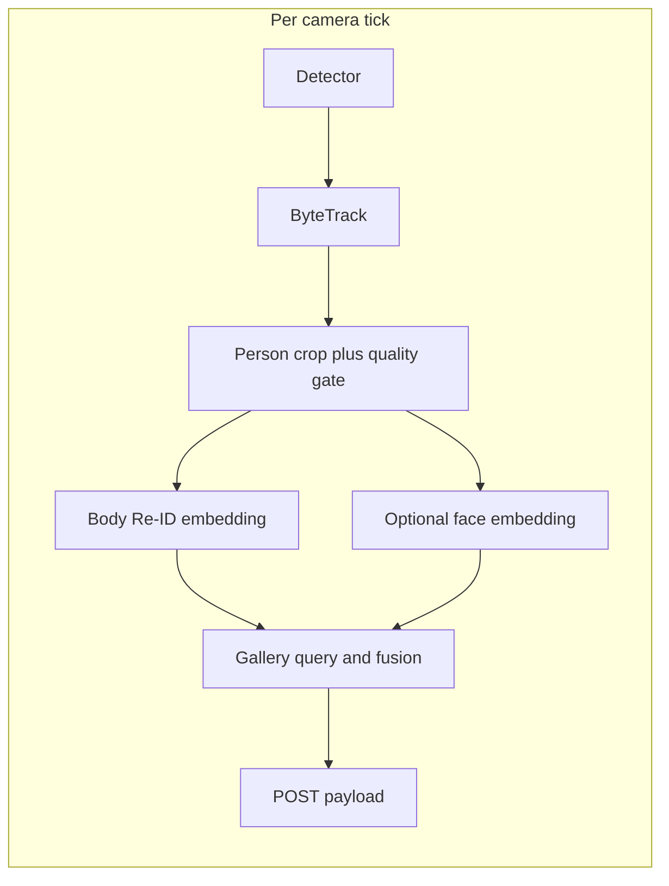

# Re-identification, gallery database, and identity fusion

This document describes how to extend the multi-camera tracking engine with **body re-identification (Re-ID)**, a **persistent embedding gallery**, and an optional **face recognition** layer that **fuses** with body-based tracking—without relying on face for frame-to-frame continuity.

It is aligned with the current pipeline in `tracking_engine/multi_camera.py`.

## Goals

- **Stable anonymous continuity** across cameras and time via body appearance (Re-ID), not only per-stream ByteTrack IDs.
- A **database-backed gallery** that can accumulate high-quality embeddings over time under explicit quality and confidence rules.
- **Face recognition as a separate modality** that assigns or merges **named identities** when confidence is sufficient; body tracking remains the backbone for detection and short-term association.
- **Clear auditability**: fusion decisions, thresholds, and model versions are traceable.

## Current pipeline (integration anchor)

Today the flow is:

1. Per camera: detector → ByteTrack (`tracking_engine/pipeline/tracker_bytetrack.py`) → homography to floor coordinates.
2. Each person in the outbound payload uses a **local** id: `t{tracker_id}` (string).
3. `PositionPoster` (`tracking_engine/pipeline/poster.py`) POSTs JSON batches to the configured sink.

Re-ID and global identity belong **after** tracked boxes exist and **before or while** assembling the `persons` list that is POSTed. ByteTrack IDs stay **local handles**; the system adds **global** ids (and optional **identity** labels) derived from the gallery and fusion logic.



## Design principles

1. **Body-first tracking** — Frame-to-frame and coarse cross-camera association use person crops and body Re-ID. Face is not required every frame.
2. **Separate models, fused state** — Body embedding model and face embedding model are independent; fusion consumes both as evidence with different thresholds.
3. **Probabilistic fusion** — Prefer updating belief over an identity hypothesis (scores, tentative vs confirmed links) rather than irreversible merges on a single frame.
4. **Conservative gallery learning** — Add or update persistent gallery rows only when association confidence and crop quality exceed configured bars; bound prototypes per identity to limit drift.

## Storage stack

### Recommended default: PostgreSQL + pgvector

Use when the deployment is **centralized** (single service, enrollment UI, multiple consumers, backups, compliance):

- One ACID store for **metadata**, **vectors**, filtered similarity search, and audit tables.
- Natural fit for multi-tenant or multi-site rows (`tenant_id`, `site_id`) and retention policies.

### Alternative: SQLite + FAISS

Use for **single-process**, **edge**, or **offline** bundles:

- SQLite holds relational entities, sighting logs, fusion events.
- FAISS (in-process or periodic snapshots on disk) handles approximate nearest-neighbor search; keep a stable **id map** between FAISS row index and DB primary keys.

### Abstraction

Both options should implement the same logical interface (e.g. a `GalleryStore` protocol): upsert identity, insert embedding with `model_id`, query top-k neighbors with optional filters, append fusion events. Only the backend changes.

## Logical data model

Stable ids should be **UUIDs** where persistence matters. ByteTrack ids remain **ephemeral per stream**.

### Entity summary

| Entity | Purpose |
|--------|---------|
| `identity` | A person known to the system: anonymous or enrolled, optional display name, status (active/archived). |
| `appearance_embedding` | Body Re-ID vector linked to sighting/track context; nullable `identity_id` until fused; always tagged with `model_id` and dimension. |
| `face_embedding` | Face template rows; same ideas, typically stricter quality gates. |
| `track_session` / `sighting` | Optional debugging and analytics: camera, time range, pointers to best crops, tentative global assignment. |
| `fusion_event` | Append-only log of merges, splits, threshold hits, model versions (audit and tuning). |

### Schema sketch (PostgreSQL + pgvector)

Illustrative DDL—not prescriptive about every column name:

```sql
-- Enable once per database: CREATE EXTENSION IF NOT EXISTS vector;

CREATE TABLE identity (
  identity_id      UUID PRIMARY KEY DEFAULT gen_random_uuid(),
  tenant_id        TEXT NOT NULL,
  site_id          TEXT,
  display_name     TEXT,
  status           TEXT NOT NULL DEFAULT 'active',
  created_at       TIMESTAMPTZ NOT NULL DEFAULT now(),
  updated_at       TIMESTAMPTZ NOT NULL DEFAULT now()
);

CREATE TABLE appearance_embedding (
  id               BIGSERIAL PRIMARY KEY,
  identity_id      UUID REFERENCES identity(identity_id),
  embedding        vector(512) NOT NULL,  -- dimension matches model output
  model_id         TEXT NOT NULL,
  quality          REAL,
  cam_id           TEXT,
  local_track_label TEXT,
  frame_ts         TIMESTAMPTZ,
  metadata         JSONB,
  created_at       TIMESTAMPTZ NOT NULL DEFAULT now()
);
CREATE INDEX ON appearance_embedding USING ivfflat (embedding vector_cosine_ops);  -- tuning: lists probes per workload

CREATE TABLE face_embedding (
  id               BIGSERIAL PRIMARY KEY,
  identity_id      UUID REFERENCES identity(identity_id),
  embedding        vector(512) NOT NULL,
  model_id         TEXT NOT NULL,
  quality          REAL,
  enrolled         BOOLEAN NOT NULL DEFAULT false,
  cam_id           TEXT,
  frame_ts         TIMESTAMPTZ,
  metadata         JSONB,
  created_at       TIMESTAMPTZ NOT NULL DEFAULT now()
);
CREATE INDEX ON face_embedding USING ivfflat (embedding vector_cosine_ops);

CREATE TABLE sighting (
  id               BIGSERIAL PRIMARY KEY,
  global_track_id  UUID NOT NULL,
  cam_id           TEXT NOT NULL,
  started_ts       TIMESTAMPTZ NOT NULL,
  ended_ts         TIMESTAMPTZ,
  best_body_embedding_id BIGINT REFERENCES appearance_embedding(id),
  notes            JSONB
);

CREATE TABLE fusion_event (
  id               BIGSERIAL PRIMARY KEY,
  ts               TIMESTAMPTZ NOT NULL DEFAULT now(),
  event_type       TEXT NOT NULL,
  global_track_id  UUID,
  identity_id      UUID REFERENCES identity(identity_id),
  body_score       REAL,
  face_score       REAL,
  threshold_snapshot JSONB NOT NULL,
  model_ids        JSONB NOT NULL
);
```

**Indexes (conceptual):** btree on `(identity_id, created_at)`, partial indexes for `status = 'active'`, and ivfflat/hnsw (per pgvector version) on embedding columns sized to embedding dimension.

## Pipeline integration points

All steps below refer to extending the loop in `multi_camera.py` (or a dedicated module invoked from it).

1. **Crop and quality gate** — From each `tracked.xyxy`, extract a tight person crop (and optionally head region later). Skip embedding if bbox area, blur, or aspect fails thresholds.
2. **Body embedding** — Run the Re-ID model (batch across persons per tick if the runtime allows). L2-normalize vectors if the metric assumes it. Record `model_id` and dimension in config.
3. **Short-term track state** — Keep a **running prototype** per active global or local hypothesis (EMA or small buffer) to smooth single-frame noise before gallery write.
4. **Gallery query** — Top-k nearest neighbors with cosine or L2 distance; apply **distance thresholds** and optional filters (`tenant_id`, active identities only).
5. **Face path (optional)** — If head crop quality is sufficient, compute face embedding; otherwise omit. Never block body-only association.
6. **Fusion** — Combine body match score and optional face score: high-confidence face can **bind** a track to an enrolled `identity_id`; body Re-ID maintains anonymous `global_person_id` when face is absent; conflicting evidence should **defer** or **split** rather than force merge.
7. **Learning** — Insert new `appearance_embedding` (and optionally `face_embedding`) rows only when rules pass; cap rows per identity; consider freezing prototypes after diversity is reached.

## Internal API sketch (Python)

```text
FusionEngine.update(
  track_state,
  body_embedding,
  face_embedding | None,
) -> GlobalTrackState
```

- `GalleryStore` (protocol): `query_body(vec, k, filters)`, `query_face(vec, k, filters)`, `insert_appearance(...)`, `insert_face(...)`, `link_track_to_identity(...)`, `log_fusion_event(...)`.
- `GlobalTrackState` should carry at least: `global_person_id`, optional `identity_id` / `display_name`, confidence fields, and last update metadata for the POST payload.

## HTTP and payload evolution

- **Enrollment (future REST):** e.g. `POST /identities/{id}/enroll-face`, `POST /identities/{id}/enroll-body` with strict auth and consent tracking.
- **Existing POST payload:** extend `persons[]` with optional backward-compatible fields, for example:
  - `global_id` — stable UUID string for the anonymous or resolved person.
  - `identity_id` — when fused to an enrolled identity.
  - `identity_name` — display name when policy allows.
  - `reid_score`, `face_score` — optional debugging (may be omitted in production).

Consumers that ignore unknown keys remain compatible.

## Configuration (YAML)

Add a block alongside existing `poster` and `tracking` keys in `tracking_engine/config.multi_camera.yaml` (exact names TBD in implementation), for example:

- Database DSN or SQLite path.
- `body_model_id`, `face_model_id`, embedding dimension.
- Distance thresholds, top-k, minimum crop size, EMA decay.
- Face enablement and face-only fusion threshold (stricter than body).
- Rates: max gallery writes per minute, max prototypes per identity.

## Phased rollout

1. **Phase A** — Body Re-ID + anonymous `global_person_id` across cameras; gallery read/write with quality gates; POST includes `global_id`.
2. **Phase B** — Gallery management, retention, admin tools, metrics on false link/split rates.
3. **Phase C** — Face enrollment, face gallery, probabilistic fusion, `fusion_event` audit stream, optional named fields in POST.

## Non-functional requirements

- **Latency** — Batch body (and face) inference; avoid per-person sequential DB round-trips where possible; consider async write-behind for non-critical gallery inserts.
- **Multi-tenancy** — Scope all queries by `tenant_id` / `site_id` from config.
- **Privacy and compliance** — Enrollment consent, retention limits, right-to-delete (cascade or anonymize `identity` and embeddings), secure storage for face templates.
- **Model upgrades** — Never mix vectors from different `model_id` in the same index query; migrate or partition tables by `model_id`.
- **Operations** — Backup/restore includes vector tables and indexes; document pgvector maintenance (reindex after bulk load).

## Risks and mitigations

| Risk | Mitigation |
|------|------------|
| Gallery drift from bad updates | Conservative thresholds, prototype caps, freeze policy, human review hooks. |
| Cross-person confusion with similar clothing | Multi-frame voting, spatial/temporal gating, face evidence when available. |
| Irreversible wrong merge | Probabilistic fusion, split events, audit log, avoid hard merge on single modality. |
| Face at distance | Use face only when quality passes; do not depend on face for continuity. |
| Model change breaks search | Version all vectors with `model_id`; separate indexes or filtered queries per version. |

## References in this repository

- `tracking_engine/multi_camera.py` — main loop and payload assembly.
- `tracking_engine/pipeline/tracker_bytetrack.py` — local ByteTrack ids.
- `tracking_engine/pipeline/poster.py` — JSON POST transport.
- `tracking_engine/config.multi_camera.yaml` — configuration entry point for future Re-ID settings.
